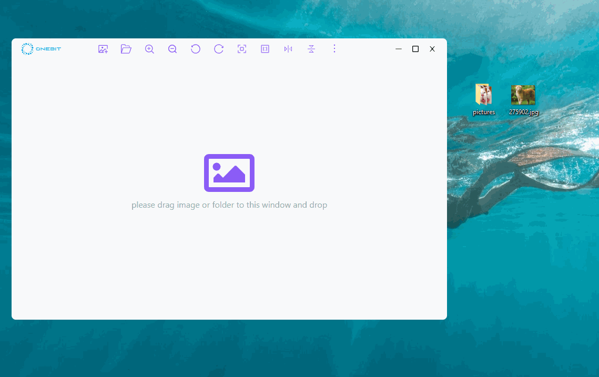
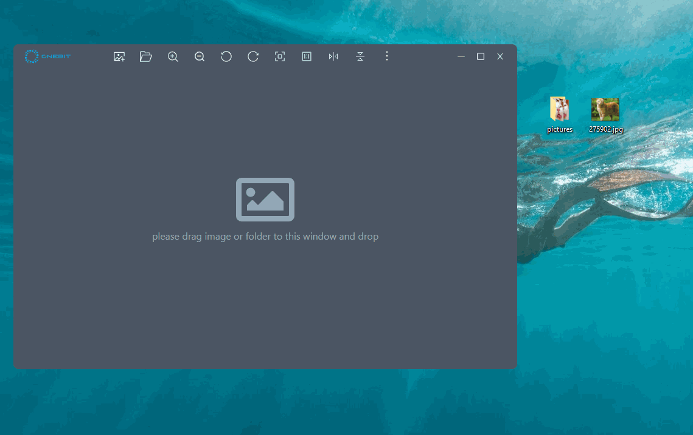

<h4 align="right"><strong>English</strong> | <a href="./README_CN.md">简体中文</a></h4>

  

<h1 align="center"/>Phtonee - 看图app</h1>

此跨平台软件用于预览、浏览图片文件，兼容多种图形格式，png, bmp, jpg,webp, gif等。
适用于windows（已发布）, mac os（未发布）, Linux（未发布）。

## 优点
- **易用** 简洁的界面设计，上手即用
- **酷** 圆角，布局等设计，输出高识别度窗口
- **可移动** 无需安装，解压缩后即用

## 下载
移步至[发布页面](https://github.com/ChqJourney/ImageProc/releases) ，
下载对应平台的压缩包，解压缩后只有一个可执行文件，复制到任何位置即可使用。

## 如何使用

### 打开图片
- 拖曳图片或文件夹到窗口
- 点击按钮
- 右键菜单
- 全局快捷键打开图片或文件夹
- 图片邮件菜单"用...打开"，或直接拖曳图片或文件夹到本app图标

### 操作图片

- 缩放
- 旋转
- 镜像
- 适配窗口
- 恢复原始大小
- 移动
### DEMO

### 暗黑模式适配
自动跟随系统主题

### 多语言
- 英文
- 中文(简体)
自动跟随系统语言，并允许菜单设置语言

## 贡献

欢迎任何issue和PR

## License

Apache-2.0 license. See [License here](./LICENSE) for details.